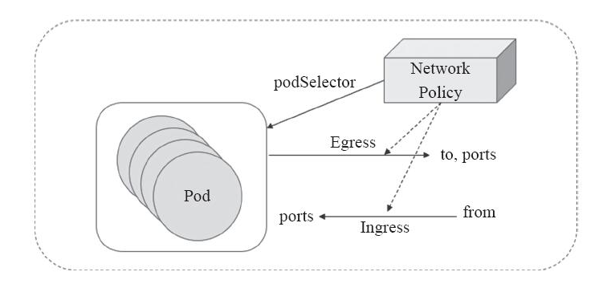

## NetworkPolicy 简介

如果希望在 IP 地址或端口层面（OSI 第 3 层或第 4 层）控制网络流量， 则可以考虑为集群中特定应用使用 Kubernetes 网络策略（NetworkPolicy）



NetworkPolicy 是一种以应用为中心的结构，允许设置如何允许 Pod 与网络上的各类网络“实体” （这里使用实体以避免过度使用诸如“端点”和“服务”这类常用术语， 这些术语在 Kubernetes 中有特定含义）通信。

Pod 可以通信的 Pod 是通过如下三个标识符的组合来辩识的：

1. 其他被允许的 Pods（例外：Pod 无法阻塞对自身的访问）
2. 被允许的名字空间
3. IP 组块（例外：与 Pod 运行所在的节点的通信总是被允许的， 无论 Pod 或节点的 IP 地址）

在定义基于 Pod 或名字空间的 NetworkPolicy 时，会使用选择算符来设定哪些流量可以进入或离开与该算符匹配的 Pod

同时，当基于 IP 的 NetworkPolicy 被创建时，基于 IP 组块（CIDR 范围） 来定义策略


## 前置条件

网络策略通过网络插件来实现

要使用网络策略，必须使用支持 NetworkPolicy 的网络解决方案

创建一个 NetworkPolicy 资源对象而没有控制器来使它生效的话，是没有任何作用的

- 高版本 kubectl

需要安装 kubectl 高版本，用于创建 ingress 等资源

```bash
docker create --entrypoint=sh --name kubectl bitnami/kubectl:1.24.8

docker cp kubectl:/opt/bitnami/kubectl/bin/kubectl ./kubectl
```

- 需要安装 kubectl 插件列表如下
  - ns
  - ingress-nginx

## Pod 隔离的两种类型

Pod 有两种隔离

- 出口的隔离
- 入口的隔离

它们涉及到可以建立哪些连接。这里的“隔离”不是绝对的，而是意味着“有一些限制”。另外的，“非隔离方向”意味着在所述方向上没有限制。这两种隔离（或不隔离）是独立声明的， 并且都与从一个 Pod 到另一个 Pod 的连接有关。

- 默认情况下，一个 Pod 的出口是非隔离的，即所有外向连接都是被允许的。如果有任何的 NetworkPolicy 选择该 Pod 并在其 policyTypes 中包含 “Egress”，则该 Pod 是出口隔离的， 称这样的策略适用于该 Pod 的出口。当一个 Pod 的出口被隔离时， 唯一允许的来自 Pod 的连接是适用于出口的 Pod 的某个 NetworkPolicy 的 egress 列表所允许的连接。这些 egress 列表的效果是相加的。

- 默认情况下，一个 Pod 对入口是非隔离的，即所有入站连接都是被允许的。如果有任何的 NetworkPolicy 选择该 Pod 并在其 policyTypes 中包含 “Ingress”，则该 Pod 被隔离入口， 称这种策略适用于该 Pod 的入口。当一个 Pod 的入口被隔离时，唯一允许进入该 Pod 的连接是来自该 Pod 节点的连接和适用于入口的 Pod 的某个 NetworkPolicy 的 ingress 列表所允许的连接。这些 ingress 列表的效果是相加的。

网络策略是相加的，所以不会产生冲突。如果策略适用于 Pod 某一特定方向的流量，Pod 在对应方向所允许的连接是适用的网络策略所允许的集合。因此，评估的顺序不影响策略的结果。

要允许从源 Pod 到目的 Pod 的连接，源 Pod 的出口策略和目的 Pod 的入口策略都需要允许连接。如果任何一方不允许连接，建立连接将会失败。


