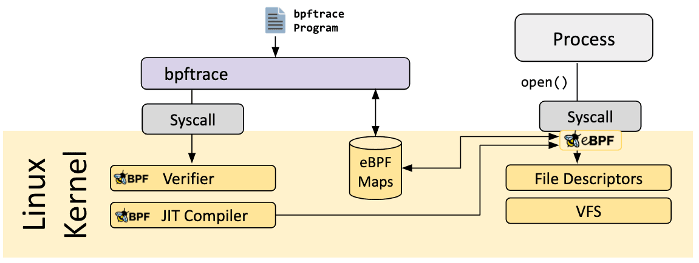

## 背景

对于算法和数据结构应该大家都不陌生，在这门学科的语境里用 O(xxx)来衡量算法的复杂度。但是实际的工作中性能工程师要回答的常常不是时间复杂度问题，而是 

- 程序的哪个部分慢？ 
- 慢的部分，单次执行的耗时是多少？

eBPF 能在不改一行代码的情况下，知道给定函数单次执行的耗时，并且是纳秒级别的精度。

官方：

- 官网：<https://ebpf.io/>
- 项目列表：<https://ebpf.io/applications/>

## 原理

进程运行在操作系统（kernel）之上，也就是说进程干了什么，现在在干什么操作系统是清清楚楚的。

这样的话！问题 2 的解决方案就变成了告诉操作系统，让它帮忙盯一下给定函数在什么时候开始执行，并且什么时候执行完成。我们只要拿到这两个时间点就能算出特定函数单次执行的耗时。

那我们怎么才能告诉操作系统呢？

Linux 内核里面有一个叫 eBPF 的框架，它是我们与内核对话的接口人。我们使用一门叫 bpftrace 的语言就可以和它对话，把我们想要做的事情告诉它。

eBPF 的整体的架构如下：

