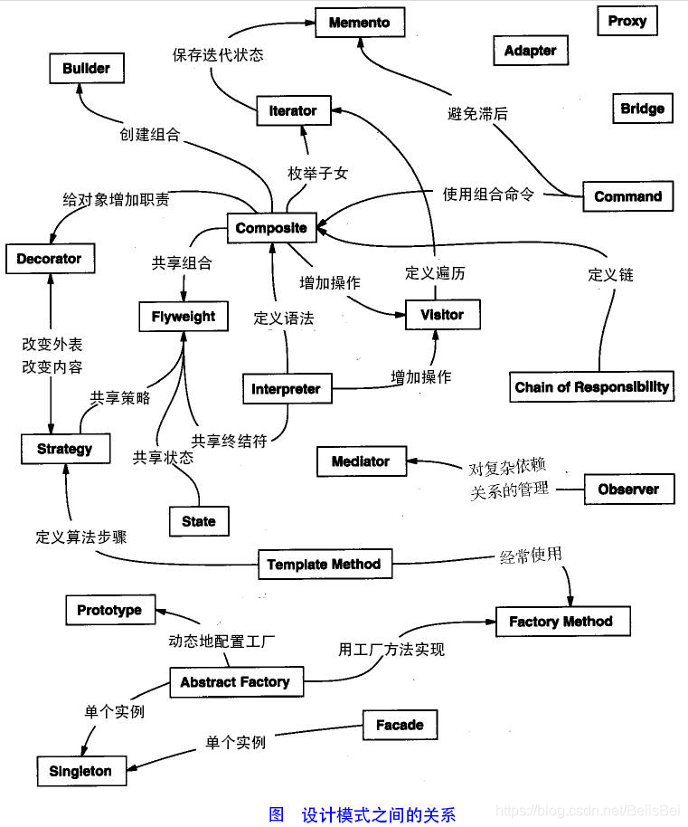
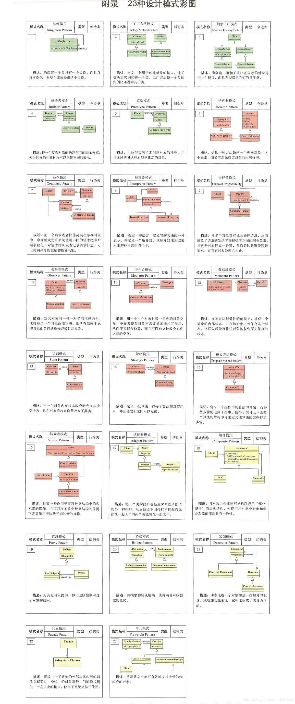

## 设计模式概述

设计模式：代表了最佳的实践，通常被有经验的面向对象的软件开发人员所采用。设计模式是软件开发人员在软件开发过程中面临的一般问题的解决方案。这些解决方案是众多软件开发人员经过相当长的一段时间的试验和错误总结出来的。

设计模式是一套被反复使用的、多数人知晓的、经过分类编目的、代码设计经验的总结。使用设计模式是为了重用代码、让代码更容易被他人理解、保证代码可靠性。 毫无疑问，设计模式于己于他人于系统都是多赢的，设计模式使代码编制真正工程化，设计模式是软件工程的基石，如同大厦的一块块砖石一样。项目中合理地运用设计模式可以完美地解决很多问题，每种模式在现实中都有相应的原理来与之对应，每种模式都描述了一个在我们周围不断重复发生的问题，以及该问题的核心解决方案，这也是设计模式能被广泛应用的原因。

GOF介绍:在 1994 年，由 Erich Gamma、Richard Helm、Ralph Johnson 和 John Vlissides 四人合著出版了一本名为 Design Patterns - Elements of Reusable Object-Oriented Software（中文译名：设计模式 - 可复用的面向对象软件元素） 的书，该书首次提到了软件开发中设计模式的概念。
四位作者合称 GOF（四人帮，全拼 Gang of Four）。他们所提出的设计模式主要是基于以下的面向对象设计原则。

对接口编程而不是对实现编程。

优先使用对象组合而不是继承。

## 设计模式 3 大类

### 创建型模式

创建型模式（Creational Patterns）：

（都是用来帮助我们创建对象的）这些设计模式提供了一种在创建对象的同时隐藏创建逻辑的方式，而不是使用 new 运算符直接实例化对象。这使得程序在判断针对某个给定实例需要创建哪些对象时更加灵活。主要包括：

单例模式（Singleton Pattern）：保证一个类仅有一个对象，并提供一个访问它的全局访问点。

工厂模式（Factory Pattern）：定义一个用于创建对象的接口，让子类决定将哪一个类实例化，FactoryMethod使一个类的实例化延迟到其子类。

抽象工厂模式（Abstract Factory Pattern）：提供一个创建一系列相关或相互依赖对象的接口，而无需指定它们的具体类。

建造者模式（Builder Pattern）：将一个复杂对象的构建与它的表示分离，使得同样的构建过程可以创建不同的表示。

原型模式（Prototype Pattern）:用原型实例指定创建对象的种类，并且通过拷贝这个原型来创建新的对象。

### 结构型模式

结构型模式（Structural Patterns）：这些设计模式关注类和对象的组合。继承的概念被用来组合接口和定义组合对象获得新功能的方式。主要包括：

适配器模式（Adapter Pattern）：将一个类的接口转换成客户希望的另一个接口。Adapter模式使得原本由于接口不兼容而不能一起工作的那些类可以一起工作。

桥接模式（Bridge Pattern）：将抽象部分与它的实现部分分离，使他们都可以独立地变化。

装饰模式（Decorator Pattern）：动态地给一个对象添加一些额外的职责。就扩展功能而言，Decorator模式比生成子类的方式更为灵活。

组合模式（Composite Pattern）：将对象组合成树形结构以表示“部分-整体”的层次结构。Composite 使得客户对单个对象和复合对象的使用具有一致性。

外观模式（Facade Pattern）：为子系统中的一组接口提供一个一致的接口。Façade模式定义了一个高层接口，这个接口使得这一子系统更加容易使用。

享元模式（Flyweight Pattern）：运用共享技术有效地支持大量细粒度的对象。

代理模式（Proxy Pattern）:为其他对象提供一个代理以控制对这个对象的访问。

### 行为型模式

行为型模式（Behavioral Patterns）：这些设计模式特别关注对象之间的通信。主要包括：

模版方法模式（Template Pattern）:定义一个操作中的算法的骨架，而将一些步骤延迟到子类。TemplateMethod 使得子类可以不改变一个算法的结构即可重定义该算法的某些特定步骤。

命令模式（Command Pattern）：将一个请求封装为一个对象，从而使你可用不同的请求对客户进行参数化，对请求排队或记录请求日志，以及支持可取消的操作。

迭代器模式（Iterator Pattern）：提供一种方法顺序访问一个聚合对象中各个元素，而又不需暴露该对象的内部表示。

观察者模式（Observer Pattern）：定义对象间的一种一对多的依赖关系，以便当一个对象的状态发生改变时，所有依赖于它的对象都得到通知并自动刷新。

中介者模式（Mediator Pattern）：用一个中介对象来封装一系列的对象交互。中介者使各对象不需要显示地相互引用，从而使其耦合松散，而且可以独立地改变它们之间的交互。

备忘录模式（Memento Pattern）：在不破坏封装性的前提下，捕获一个对象的内部状态，并在该对象之外保持该状态，这样以后就可以将该对象恢复到保存的状态。

解释器模式（Interpreter Pattern）：定义一个语言，定义它的文法的一种表示，并定义一个解释器，该解释器使用该表示来解释语言中的句子。

状态模式（State Pattern）:允许一个对象在其内部状态改变时改变它的行为。对象看起来似乎修改了它所属的类。

策略模式（Strategy Pattern）:定义一系列的算法，把它们一个个封装起来，并且使他们可相互替换。本模式使得算法的变化可以独立于使用它的客户。

责任链模式（Chain of Responsibility Pattern）：为解除请求的发送者和接收者之间的耦合，而使多个对象都有机会处理这个请求。将这些对象连成一条链，并沿着这条链传递该请求，直到有对象处理它。

访问者模式（Visitor Pattern）:表示一个作用于某对象结构中的各元素的操作。它使你可以在不改变各元素类别的前提下定义作用于这些元素的新操作。

### 其他

此外还有一些J2EE模式：这些设计模式特别关注表示层。这些模式是由 Sun Java Center 鉴定的。

- MVC 模式（MVC Pattern）

- 业务代表模式（Business Delegate Pattern）

- 组合实体模式（Composite Entity Pattern）

- 数据访问对象模式（Data Access Object Pattern）

- 前端控制器模式（Front Controller Pattern）

- 拦截过滤器模式（Intercepting Filter Pattern）

- 服务定位器模式（Service Locator Pattern）

- 传输对象模式（Transfer Object Pattern）

## 设计模式的七大原则

1、开闭原则（Open Close Principle）

开闭原则的意思是：对扩展开放，对修改关闭。在程序需要进行拓展的时候，不能去修改原有的代码，实现一个热插拔的效果。简言之，是为了使程序的扩展性好，易于维护和升级。想要达到这样的效果，我们需要使用接口和抽象类，后面的具体设计中我们会提到这点。

2、里氏代换原则（Liskov Substitution Principle）

里氏代换原则是面向对象设计的基本原则之一。 里氏代换原则中说，任何基类可以出现的地方，子类一定可以出现。LSP 是继承复用的基石，只有当派生类可以替换掉基类，且软件单位的功能不受到影响时，基类才能真正被复用，而派生类也能够在基类的基础上增加新的行为。里氏代换原则是对开闭原则的补充。实现开闭原则的关键步骤就是抽象化，而基类与子类的继承关系就是抽象化的具体实现，所以里氏代换原则是对实现抽象化的具体步骤的规范。

3、依赖倒转原则（Dependence Inversion Principle）

这个原则是开闭原则的基础，具体内容：针对接口编程，依赖于抽象而不依赖于具体。

4、接口隔离原则（Interface Segregation Principle）

这个原则的意思是：使用多个隔离的接口，比使用单个接口要好。它还有另外一个意思是：降低类之间的耦合度。由此可见，其实设计模式就是从大型软件架构出发、便于升级和维护的软件设计思想，它强调降低依赖，降低耦合。

5、迪米特法则，又称最少知道原则（Demeter Principle）

最少知道原则是指：一个实体应当尽量少地与其他实体之间发生相互作用，使得系统功能模块相对独立。

6、合成复用原则（Composite Reuse Principle）

合成复用原则是指：尽量使用合成/聚合的方式，而不是使用继承。

7、单一职责原则
